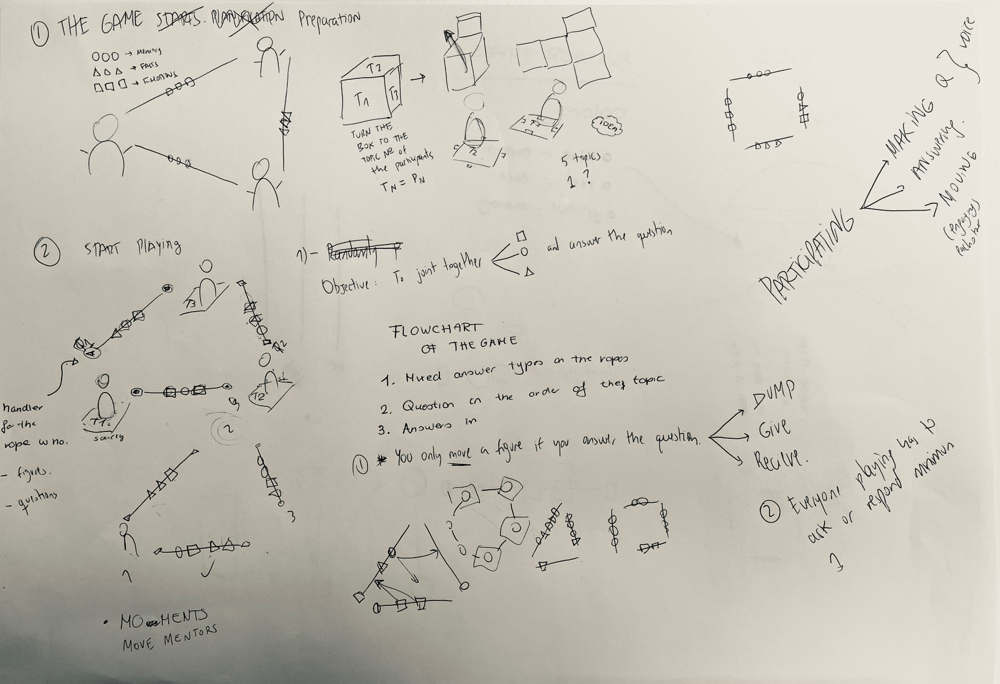
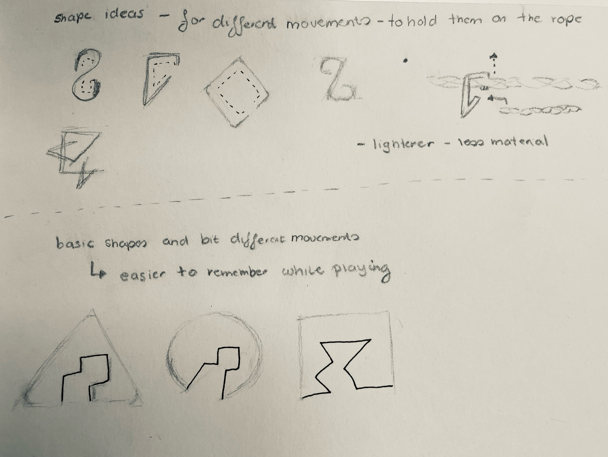

# Fab Academy Challenge I

#### By [José Hirmas](https://jose-hirmas.github.io/mdefportafolio/fab%20academy/Challenges/), [Borbala Moravcsik](https://borbalamoravcsik.github.io/mdef-borka/Fabacademy-challenge1.html) & [Anna Mestres](https://anna-mestres.github.io/anna.mestres/fab/c1.html)

>Goal:
To create a participatory game for sharing realities and connect them.

## CREUAR EL PONT *(cross the bridge)*

*Elle creu la corda per a que tots puguem passar. (they cross the rope for let all of us pass)*
“Creu” is a cross and  to cross, but it is also believing. So we created this metaphor to understand the value of the name.

**“Creu” in kids as agents of change that can transform the world.**

### What is this game?

It is a game to shape our common realities, to connect and to be able to express ourselves to each other. To create those bridges that separate us. It is also a game of mobility and agility. We have to listen and communicate to be aware of the situation around us.

Imagine this scenario:

*Kids formulating questions and answering about important topics for the future, generating reflection and new points of view. All this is happening as part of the game where shapes and ropes are the triggers for participation. Everyone has the chance to formulate a question and to respond to an answer, making the shapes go from one rope to another.*

-insert image-
*Drawing of the game simulation*

### Why this game?

Democratizing participation is a big challenge when imagining and co-creating the future(s). The decisions that we make as society are commonly led by the same people, generating a misunderstanding of issues and a lack of holistic wellbeing.

This game **empowers kids as agents of change**, towards participation on important topics for better futures. **Participation** is not only a way of responding, but also a way of asking the right questions about what life, relationships, society, nature, tech means.

Trying to connect body movement and the freedom of speech as a powerful participation tool, we are enabling a new way of communication between humans.

You can´t reach your goal without communicating and acting at the same time.

## How to play?

### Theoretical rules for playing

1. The goal of the game is to have the same shape of figures in each rope.
2. Everyone playing must ask a question or /and respond and answer (everyone has to participate).
3. When answering a question you can move one figure from one rope to another, or just drop it out.
4. You only win when everyone wins.

### Preparation

1. Open the box - place the sides of the box on the ground and step on them - you ask a question based on the topic you are standing on.
2. Hold 2 ropes in your hands.
3. Place any amount of shapes on the ropes, just make sure they are mixed.

### Play

1. Form a question based on your [**topic**](https://github.com/Anna-Mestres/fab_challenge_I#topics-of-references).
2. Decide which rope you want to fill up with it’s shapes and ask the question from people who has those shapes.
3. Answer the question with a memory, a fact or an emotion - with the answer type of the shape you have chosen.

#### Topics of references

* Friends, family and people around (Society):
  >  Why is society important?
    How will relations between humans develop in the future?
    What type of society is going to be better for the future?

* Nature
  >  Why is nature important?
    How will the environment be transformed?
    What do you know about nature?

* Your City (Environment)

* Internet and Social Media (communication technology)
  >  Why can social media be dangerous?
    How do we create awareness about the proper use of technology?
    What is behind the internet?

* Your school (education)
  > Why do we learn?
    How is education changing in the world?
    What is the most important learning?

* You (Identity)

Other topics:
* Art
    >Why does art not disappearing?
    How does art affect humans?
    What is art?

* Languages
  >  Why are there?
    How do humans communicate?
    What is language?

## Process

### Steps

1. [Sharing Ideas and Interest](https://github.com/Anna-Mestres/fab_challenge_I#sharing-ideas-and-interest)
2. [Make the repository](https://github.com/Anna-Mestres/fab_challenge_I#make-the-repository)
3. [Brainstorming](https://github.com/Anna-Mestres/fab_challenge_I#brainstorming)
4. [Prototype 1](https://github.com/Anna-Mestres/fab_challenge_I#prototype-1)
6. [First drawings](https://github.com/Anna-Mestres/fab_challenge_I#first-ideas)
7. [Prototype 2 (Defining rules)](https://github.com/Anna-Mestres/fab_challenge_I#prototype-2)
8. [Design shapes and materials](https://github.com/Anna-Mestres/fab_challenge_I#design-shapes-and-materials)
9. [Prototype 3 (laser cut cardboard v1)](https://github.com/Anna-Mestres/fab_challenge_I#prototype-3)
10. [Prototype 4 (cardboard v2)](https://github.com/Anna-Mestres/fab_challenge_I#prototype-4)

### Sharing Ideas and Interest

We are a dispersed group from different cultures and different backgrounds. In order to initiate a starting point we have shared our personal and coercive interests with each other on the basis of the template that fabacademy has provided us with in the miro.

Our focus is on connection, education, cooperation and understanding between different generations. To be able to see other points of view. As well as the interaction of play itself, the main tool used by children as a bridge between the real world and their fantasy world. For this reason we decided to focus on creating a participatory game for sharing realities and connect them.

### Make the repository

Once we focused on the topic, we created a common repository to upload all the files, so that all the research on this game can be an open resource. In addition, in order to be able to work together more comfortably and so that we can all edit all the documents, we use the fork programme.

### Brainstorming

Knowing the topic (participatory game for sharing realities and connect them) we focused on how we could create that sharing of ideas, which so ancestrally unites us; communication. This can be in many ways; verbal, non-verbal, written, with legs, sign language, spoken, movements, looks, etc.

We decided to investigate currently existing collaborative games that require communication as a secondary or not so commonly played function, such as twister or mime. As well as current game designers or game design companies.   

### Prototype 1

### First drawings

### Prototype 2

### Design Shapes and materials

### Prototype 3

### Prototype 4
